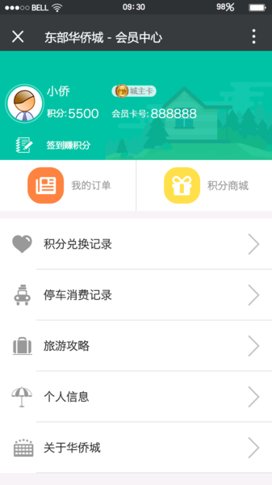
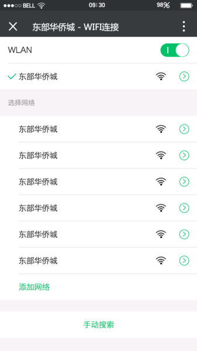

## 微信小程序+微信管理后台+微信用户前台

> **GitHub：[https://github.com/JoeyBling/hqc_mp](https://github.com/JoeyBling/hqc_mp)**

> **码云：[https://gitee.com/zhousiwei/hqc_mp](https://gitee.com/zhousiwei/hqc_mp)**

> **欢迎使用和Star支持，如使用过程中碰到问题，可以提出Issue，我会尽力完善**

## 产品介绍
-----------------------------------
**&#160;&#160;&#160;&#160;基础功能开发：景区微信地图导游、天气及景点相关资讯微信提醒、项目适玩人群识别与推荐、会员功能、景区美食预订功能、停车付费功能、票价信息查询设置、免费WiFi连接设置。**

**&#160;&#160;&#160;&#160;微信小程序：开发一款用于门票销售的小程序，让用户无需关注，直接一键购票，提供快捷、便利的线上购票服务。**

## 项目结构
```lua
hqc_mini_app 微信小程序相关文件

hqc_mp
├── sql  -- 项目SQL语句
│
├── config -- 配置信息
│
├── controller -- 控制器
|    ├── map -- 3D地图
|    ├── wx -- 微信前台控制器
|    ├── octopus -- 后台管理员控制器
│
├── service -- 业务逻辑接口
|    ├── impl -- 业务逻辑接口实现类
│
├── dao -- 数据访问接口
├
├── entity -- 数据持久化实体类
│
├── datasources -- 多数据源工具类
│
├── shiro -- Shiro验证框架
│
├── task -- Quartz定时任务
│
├── util -- 项目所用的的所有工具类
|    ├── FreeMarker -- 自定义FreeMarker标签
│
├── payforparking -- 停车付费相关接口WebService
│
├── weather -- 第三方天气查询相关接口WebService
│
├── ws -- 提供给小程序的相关接口WebService
│
├── resources
|    ├── mapper -- SQL对应的XML文件
│
├── webapp
|    ├── map -- 3D地图
|    ├── statics -- 静态资源
|    ├── upload -- 上传文件
|    ├── WEB-INF
|    |    ├── templates -- 页面FreeMarker模版
```

## 技术选型
- 核心框架：`Spring`
- 安全框架：`Apache Shiro`
- 视图框架：`Spring MVC`
- 持久层框架：`MyBatis`、`MyBatis通用Mapper`
- 缓存技术：`Redis`
- 定时器：`Quartz`
- 数据库连接池：`Druid`
- 日志管理：`SLF4J`、`Log4j`
- 模版技术：`FreeMarker`
- 页面交互：`BootStrap`、`Layer`等

## 本地部署
- 创建数据库**hqc_mp**，数据库编码为`UTF-8`
- 执行**sql/hqc_mp.sql**文件，初始化数据
- 修改**db.properties**，更新MySQL账号和密码
- 修改**redis.properties**,更改Redis连接信息
- Eclipse、IDEA部署Tomcat，则可启动项目
- 项目访问路径：http://localhost:8080/octopus
- 后台登陆账号密码：**admin/admin**
- 前台登录用户: **13647910412/123**

## 启动说明

> 项目依赖`mysql`、`Redis`服务.

## 演示效果图
|  |  |
| :---: | :---: |
|  |  |
|  |  |